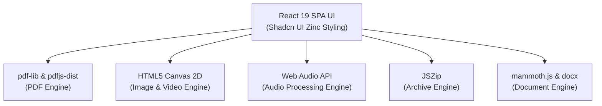

# ⚡ Toolwala — Fast & Free Client-Side File Tools & Exam Specifications

**Toolwala** is an open-source, ultra-fast, 100% client-side web application for file operations and official exam document specifications. Built with **React 19**, **Vite**, **pdf-lib**, **pdfjs-dist**, **Web Audio API**, **JSZip**, and **Shadcn UI** design primitives.

> 🔒 **100% In-Browser Privacy**: Files are processed locally inside your browser memory. Zero files are ever uploaded to any remote server or third-party storage.

---

## 🌟 Key Features

### 🎯 Official Exam Document Specifications (`/exams`)
Contains strict document size, format, dimension, and submission guidelines for 15 official Indian competitive exams:
- **Medical & Engineering**: NEET UG, JEE Main, CUET UG, GATE
- **Civil & Defense Services**: UPSC Civil Services (CSE), UPSC NDA / CDS
- **Staff Selection & Railways**: SSC CGL, SSC CHSL, SSC GD Constable, RRB NTPC, RRB Group D
- **Banking, Teaching & Management**: IBPS PO / Clerk, CTET, CAT, UGC NET

> ⚠️ Includes prominent official website verification disclaimers and instant `"Prepare File →"` quick action triggers.

### 📄 42+ Client-Side Processing Tools (`/tools`)
- **PDF Engine**: Merge, Split, Rotate, Compress, Watermark, Add Page Numbers, Digital Signature Drawing Canvas, Redaction Masking, PDF to Images rendering (`pdfjs-dist`).
- **Image Engine**: Convert (PNG ↔ JPG ↔ WebP ↔ BMP), Resize, Rotate, Crop, Flip (Horizontal/Vertical), Compress, Images to PDF.
- **Audio Engine**: Trim Audio, Volume Gain, Speed Change, Multi-Track Audio Merger, WAV Encoder via Web Audio API.
- **Video Engine**: Trim Video, Speed Resampling, Mute Video via HTML5 Video Canvas Streams.
- **Document Engine**: Word to PDF (`.docx` → PDF via `mammoth.js`) and PDF to Word (`.pdf` → `.docx` via `docx`).
- **Archive Engine**: Create and Extract `.zip` archives via `JSZip`.

### 🎨 Modern Shadcn UI & Internationalization
- **Shadcn UI Design Tokens**: Zinc color palette, glassmorphism sticky navigation, ambient backdrop radial glow, command-palette omni search (`⌘K`).
- **10 Regional & Mainstream Languages**: English, Hindi (हिन्दी), Bengali (বাংলা), Tamil (தமிழ்), Telugu (తెలుగు), Marathi (मराठी), Gujarati (ગુજરાતી), Kannada (કન્નડ), Malayalam (മലയാളം), Punjabi (ਪੰਜਾਬੀ).

---

## 🚀 Getting Started

### Prerequisites
- Node.js (v18 or higher)
- npm or pnpm

### Installation

1. **Clone the repository**:
   ```bash
   git clone https://github.com/Jalaj1973/Toolwala.git
   cd Toolwala
   ```

2. **Install dependencies**:
   ```bash
   npm install
   ```

3. **Start the local development server**:
   ```bash
   npm run dev
   ```

4. **Build for production**:
   ```bash
   npm run build
   ```

---

## 🛠️ Architecture & Technology Stack



---

## 🔒 Privacy & Security

Toolwala is designed with a strict zero-server privacy architecture:
- Files stay on your local device at all times.
- Zero network bandwidth consumption for uploads.
- Works offline once loaded in the browser.

---

## 📜 License

Distributed under the MIT License. See `LICENSE` for more information.
